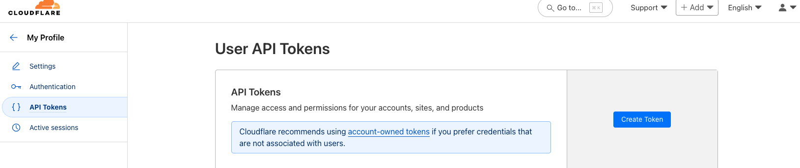
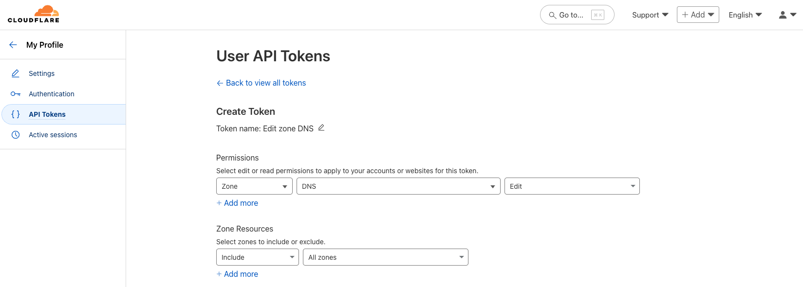
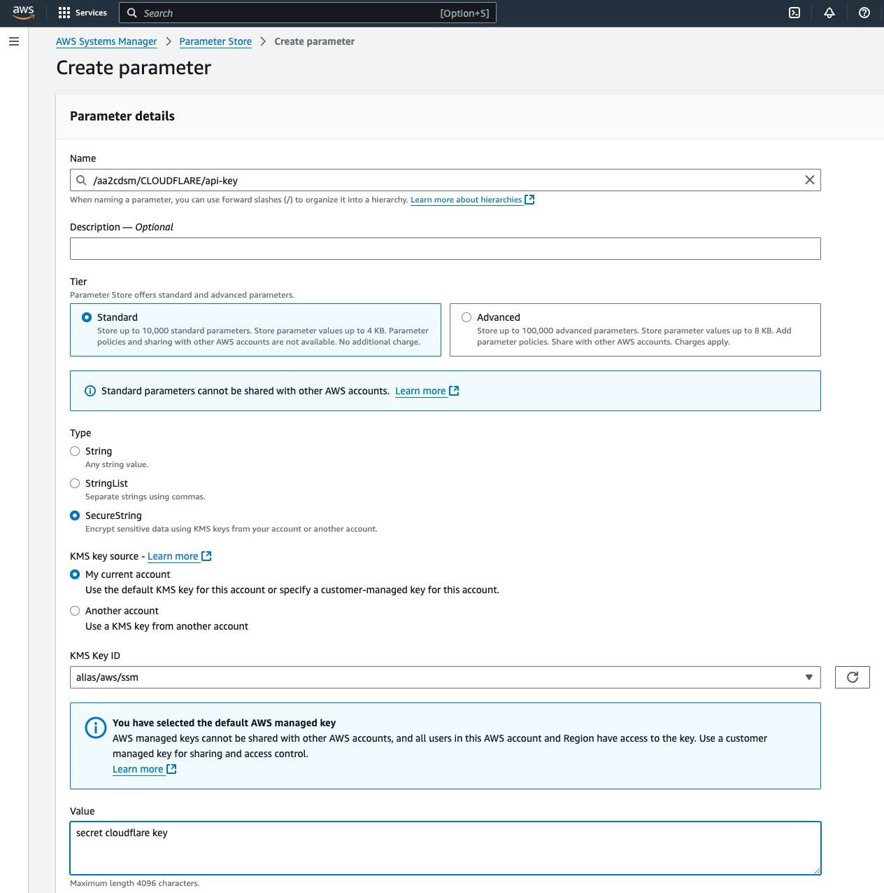

# **A**utomated **A**WS to **C**loudflare **D**NS **S**ync **M**agic

- [**A**utomated **A**WS to **C**loudflare **D**NS **S**ync **M**agic](#automated-aws-to-cloudflare-dns-sync-magic)
  - [What?](#what)
  - [How does is it work?](#how-does-is-it-work)
  - [Roadmap](#roadmap)
  - [Prerequisites](#prerequisites)
    - [Enable AWS Config](#enable-aws-config)
    - [Create and store a Cloudflare API Key](#create-and-store-a-cloudflare-api-key)
  - [Configuration](#configuration)
    - [deploymentRegions](#deploymentregions)
    - [dnsProvider](#dnsprovider)
    - [notificationSnsTopicArn](#notificationsnstopicarn)
  - [Deployment](#deployment)

## What?

Already a fan of Cloudflare or too greedy to pay for AWS hosted zones? This project will automatically create DNS entries in your Cloudflare subscription, when:

- [x] a fresh ACM certificate needs to be validated through the DNS challenge.
- [ ] a new Cloudfront distribution with custom domain is added.
- [ ] an API Gateway with custom domain is provisioned.
- [ ] a Cognito custom domain is added.

## How does is it work?

Custom AWS Config Lambda rules with some Cloudflare SDK taped to it.

## Roadmap

The implementation is intentionally designed for extensibility, to allow additional connectors for other DNS registrars. Cloudflare is the starting point but there nothing blocking us from implementing more provider, like netcup for example, see clients in: `lambda/repo`

## Prerequisites

### Enable AWS Config

If not already done, enable AWS Config in the AWS console in the regions you want to deploy the stacks into and the resource types you want to monitor.

> AWS Config can be costly if configured incorrectly, you have been warned.

### Create and store a Cloudflare API Key

1) Create a new Cloudflare API key using the Cloudflare dashboard:

2) The implementation can make use of multiple zones, so you can grant access to it if you want to:

Lastly, you need to deploy the created API key manually in all regions (because cloudformation hates SecureString <https://docs.aws.amazon.com/AWSCloudFormation/latest/UserGuide/aws-resource-ssm-parameter.html#cfn-ssm-parameter-type>). Follow the naming schema: `/aa2cdsm/${DNSProvider}$/api-key`:

## Configuration
Look into the `bin/aa2cdsm.ts`file, where you can configure following things:

### deploymentRegions
List of regions you want to deploy your resources.

> Besides your personal primary region, `us-east-1` makes more than sense for Cloudfront and Cognito custom domains which need to be deployed in there.

### dnsProvider
For now it is only `DnsProvider.CLOUDFLARE` but could be changed if support for more provider exist.

### notificationSnsTopicArn

If you are using [sns2slack](https://github.com/hikkoiri/sns2slack), you will get certificate creation deletion event notifications into your configured Slack channel.

## Deployment
Run `cdk deploy`. Et voila.

